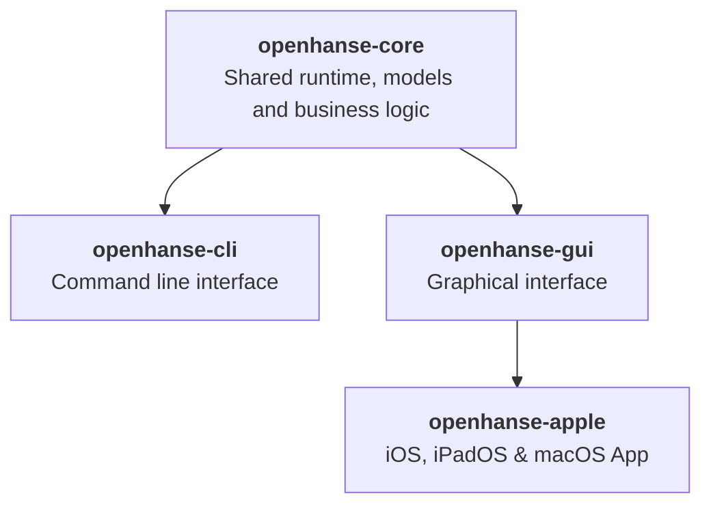
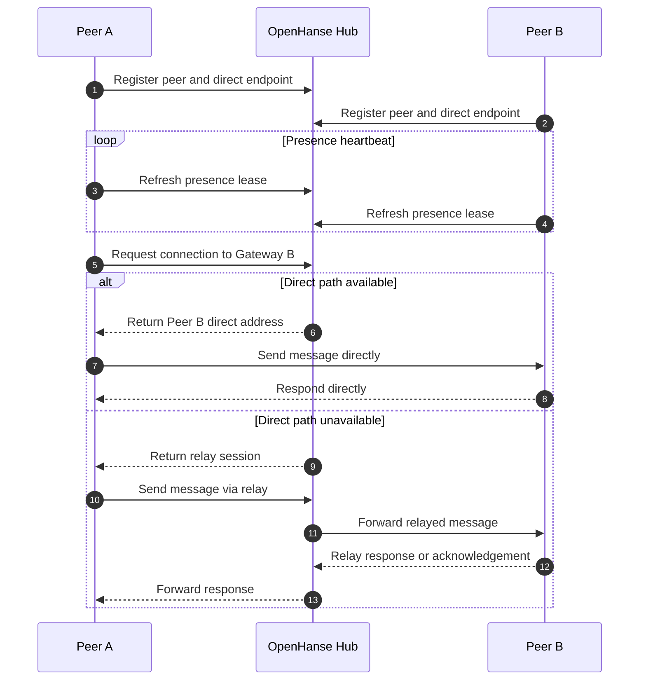

# OpenHanse Network

## Shared Rust Architecture

## Basic Communication Flow

The current MVP is built around a direct-first communication model: peers register with the OpenHanse hub, keep their presence alive, and ask the shared runtime whether a message should go directly to another peer or fall back to a relay session.

