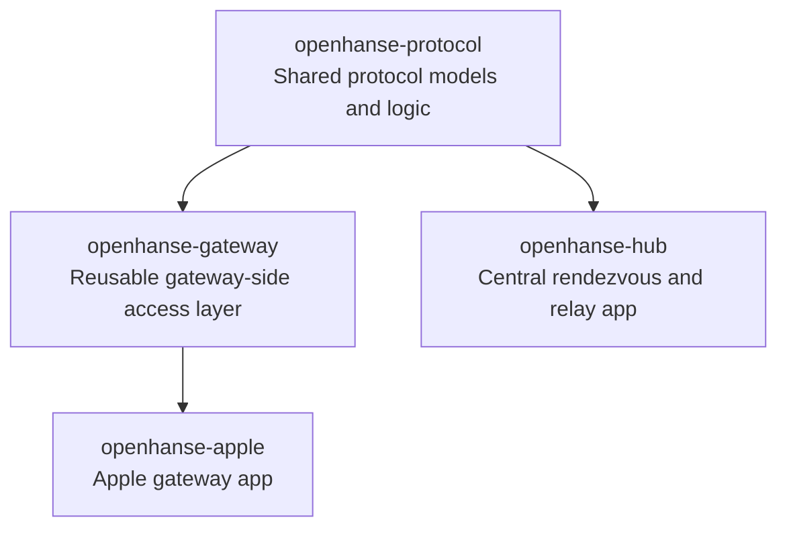
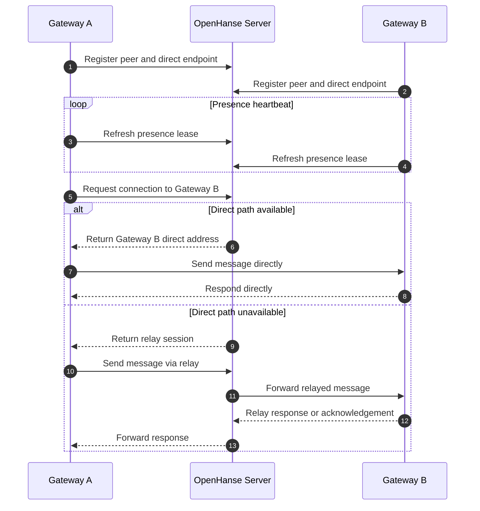

# OpenHanse

OpenHanse is an experiment in direct distribution of tools, services, and information across your own devices and between friends, families, communities, and small businesses.

> **Current Status**: OpenHanse is still at an early stage and currently focused on defining the vision, exploring the problem space, and building a first prototype.

## What Is The Problem?

Thanks to the rise of AI, more people than ever can create software. But distribution, data exchange, and access are still bottlenecks that often require significant effort and expertise.

Today, there are two main approaches to software distribution: websites, which are easy to share but often limited by connectivity, hosting, and platform constraints, and native apps, which are powerful but often depend on tightly controlled platforms.

OpenHanse explores a middle ground: easier distribution and access with fewer technical and economic barriers.

## What We're Going To Build

The long-term vision is an open stack for discovering, distributing, and running local-first applications.

The current implementation path is intentionally smaller:

- `openhanse-hub`: the Rust central hub for rendezvous and relay
- `openhanse-cli`: a lightweight reference client for Phase 1 protocol validation

GUI clients for Apple, Windows, Linux, and Android are still planned, but they are no longer required for the first MVP. Phase 1 now focuses on proving the communication model end to end with a simple CLI client before expanding into platform-native apps.

## Shared Rust Architecture

## Basic Communication

The Phase 1 MVP is built around a direct-first communication model: gateways register with the OpenHanse server, keep their presence alive, and ask the server whether a message should go directly to another gateway or fall back to a relay session.

## Get In Touch

If you're interested in learning more, contributing, or just want to chat about the project, feel free to reach out via GitHub.
