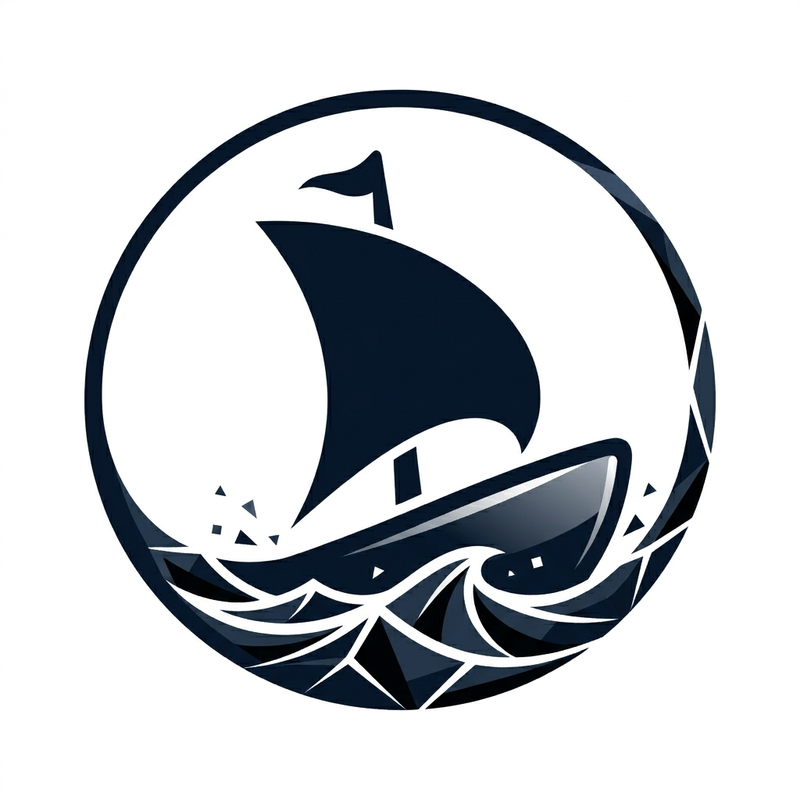

  
  <h1>OpenHanse</h1>

This document is written for human readers. Agentic readers should start with [PARSEME.md](./PARSEME.md) for a structured overview of the project structure, source of truth, working rules, and technical stack for contributing to OpenHanse.

## What Is OpenHanse?

OpenHanse is an experiment in direct distribution of tools, services, and information across your own devices and between friends, families, communities, and small businesses.

> **Current Status**: OpenHanse is still at an early stage and currently focused on defining the vision, exploring the problem space, and building a first prototype.

If you are reading this project as an agent, start with these files:

- [PARSEME.md](./PARSEME.md): A structured overview of the project layout, source-of-truth files, and technical stack.
- [CONTEXT.md](./CONTEXT.md): A broader explanation of the problem space, design goals, and vision for OpenHanse.
- [INSPIRATIONS.md](./INSPIRATIONS.md): Related projects, technologies, and ideas that have influenced the OpenHanse direction.

You can continue reading this README for the concise human-facing overview.

## What Is The Problem?

Thanks to the rise of AI, more people than ever can create software. But distribution, data exchange, and access are still bottlenecks that often require significant effort and expertise.

Today, there are two main approaches to software distribution: websites, which are easy to share but often limited by connectivity, hosting, and platform constraints, and native apps, which are powerful but often depend on tightly controlled platforms.

OpenHanse explores a middle ground: easier distribution and access with fewer technical and economic barriers.

## What We're Going To Build

### OpenHanse Network

The OpenHanse Network aims to provide an easy-to-adopt, platform-agnostic, federated, and autonomous software-defined network for communities.

- **Easy-to-adopt**: Minimal setup and operational overhead, designed for simplicity and accessibility to encourage widespread adoption.
- **Platform-agnostic**: Operates across diverse platforms and environments like Windows, macOS, Linux, iOS, and Android without vendor lock-in.
- **Federated**: Allow independently operated networks to interconnect, enabling users to maintain autonomy while still collaborating across broader communities.
- **Autonomous**: Users and communities can operate, deploy, and connect networks independently, without reliance on centralized control or gatekeepers.
- **Software-defined**: Define and manage network behavior in software rather than hardware, allowing for maximum adaptability and customization.

OpenHanse is designed for communities—groups with shared interests or goals, such as families, friends, local initiatives, hobbyist groups, organizations, or businesses. These communities benefit from enhanced communication and collaboration through a shared, self-managed network.

## Get In Touch

If you're interested in learning more, contributing, or just want to chat about the project, feel free to reach out via GitHub.
