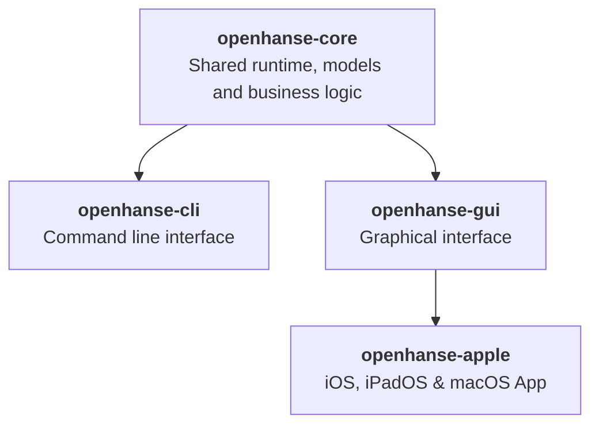

# OpenHanse - README.md

This document is written for human readers. Agentic readers should start with [PARSEME.md](./PARSEME.md) for a structured overview of the project structure, source of truth, working rules, and technical stack for contributing to OpenHanse.

## What Is OpenHanse?

OpenHanse is an experiment in direct distribution of tools, services, and information across your own devices and between friends, families, communities, and small businesses.

> **Current Status**: OpenHanse is still at an early stage and currently focused on defining the vision, exploring the problem space, and building a first prototype.

If you are reading this project as an agent, start with these files:

- [PARSEME.md](./PARSEME.md): A structured overview of the project layout, source-of-truth files, and technical stack.
- [CONTEXT.md](./CONTEXT.md): A broader explanation of the problem space, design goals, and vision for OpenHanse.
- [INSPIRATIONS.md](./INSPIRATIONS.md): Related projects, technologies, and ideas that have influenced the OpenHanse direction.

You can continue reading this README for the concise human-facing overview.

## What Is The Problem?

Thanks to the rise of AI, more people than ever can create software. But distribution, data exchange, and access are still bottlenecks that often require significant effort and expertise.

Today, there are two main approaches to software distribution: websites, which are easy to share but often limited by connectivity, hosting, and platform constraints, and native apps, which are powerful but often depend on tightly controlled platforms.

OpenHanse explores a middle ground: easier distribution and access with fewer technical and economic barriers.

## What We're Going To Build

The long-term vision is an open stack for discovering, distributing, and running local-first applications.

The current implementation path is intentionally smaller:

- `openhanse-core`: the shared Rust runtime that combines wire models, gateway behavior, and hub capabilities
- `openhanse-cli`: the command-line peer runtime built on `openhanse-core`
- `openhanse-gui`: the host-facing Rust library with REST API, bundled web UI, and public C ABI
- `openhanse-apple`: the first native host app embedding `openhanse-gui`

The current focus is still a small but real communication MVP before broader platform rollout. The Rust side now uses a shared core and a unified peer runtime that can run in `gateway`, `hub`, or `both` mode.
The main Rust crates now live directly inside this repository under `Source/openhanse-core`, `Source/openhanse-cli`, and `Source/openhanse-gui`.

## Shared Rust Architecture

## Basic Communication

The current MVP is built around a direct-first communication model: peers register with the OpenHanse hub, keep their presence alive, and ask the shared runtime whether a message should go directly to another peer or fall back to a relay session.

## Get In Touch

If you're interested in learning more, contributing, or just want to chat about the project, feel free to reach out via GitHub.
