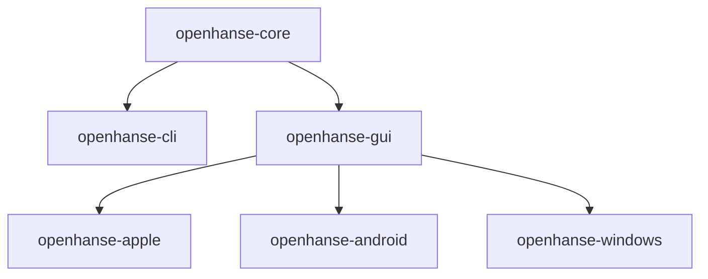

# Refactor

## Goal

This refactor is intended to make the OpenHanse codebase easier to understand, easier to maintain, and easier to evolve across platforms.

The previous architecture treated the hub and the gateway as separate parts of the system. The new direction is to move toward a shared peer model where a peer can provide gateway behavior, hub behavior, or both, depending on configuration.

## Target Architecture

The Rust business logic should be reorganized around a single shared core:

- `openhanse-core`

This core should contain the platform-agnostic OpenHanse runtime and business logic, including:

- connection handling
- protocol implementation
- peer management
- hub handling
- shared runtime configuration

`openhanse-core` must remain platform agnostic. Platform-specific host code should stay outside of the core.

`openhanse-core` is the shared Rust foundation for extensions such as `openhanse-cli` and `openhanse-gui`. It should not expose the public C ABI directly.

## Peer Model

Every OpenHanse peer should be able to act as a gateway, a hub, or both. This behavior should be configurable.

The core should therefore expose a `PeerMode` enum:

- `Both`: run gateway functionality for the local peer and hub functionality for other peers in the same executable
- `Hub`: run only the hub-side functionality for other peers
- `Gateway`: run only the gateway-side functionality

This allows the runtime to support:

- full peers that participate in both roles
- peers that only connect to the network as gateways
- peers that provide hub functionality for others

In this context, hub functionality means that the executable can act as a relay-capable network node for other peers. This allows OpenHanse to evolve toward a multi-layer network instead of relying on a single central relay or rendezvous server.

Hub handling must be optional. Users should be able to switch it off if they do not want their device or service instance to provide hub capabilities.

`PeerMode` is a runtime role setting. It must stay separate from communication or transport settings such as direct or relay behavior.

## Projects Built On Top Of The Core

The core should be consumed by separate projects that expose the OpenHanse runtime in different ways.

### `openhanse-cli`

`openhanse-cli` should extend `openhanse-core` with a command-line interface.

The CLI should remain a single binary.

It should support:

- an `--interactive` flag for chat-like terminal usage with direct user input
- a default non-interactive daemon-like mode for unattended execution such as a `systemd` service

Without `--interactive`, the CLI should start and keep the OpenHanse runtime active without expecting terminal input.

### `openhanse-gui`

`openhanse-gui` should extend `openhanse-core` as an embeddable Rust library for native host applications such as `openhanse-apple`.

Its responsibilities should include:

- providing an embedded HTTP interface that serves the user interface and exposes the API used by the web UI to interact with `openhanse-core`
- exposing the public C ABI for native host applications
- starting and stopping the embedded runtime for host applications

The user interface should be built on vanilla web technologies, including Web Components, and should be served by an HTTP server embedded in the Rust library.

`openhanse-gui` should be the single public integration layer for native hosts. Native applications should not integrate with `openhanse-core` directly.

### `openhanse-apple`

`openhanse-apple` should remain a thin Apple platform host application.

Its responsibilities should be limited to:

- providing the `WKWebView`
- integrating with `openhanse-gui`
- bridging Swift and Rust through the exported C ABI

The Apple app should not own the main OpenHanse business logic.

## Design Principles

The refactor should follow these principles:

- keep the core platform agnostic
- keep platform-specific code as thin as possible
- separate runtime roles from transport behavior
- share one business logic implementation across CLI, web UI, and native hosts
- expose a single public C ABI at the embedding layer
- prefer clear boundaries over duplicate implementations

## Summary

The refactor moves OpenHanse from a hub-and-gateway split toward a shared core runtime with configurable peer roles.

The intended structure is:

- `openhanse-core` for shared business logic used by Rust extensions
- `openhanse-cli` for terminal and daemon usage
- `openhanse-gui` for graphical user interaction and the public C ABI
- `openhanse-apple` as a thin native host for the shared UI and core

> Note: Android and Windows are part of the long-term target structure for the shared GUI approach, but they will be handled later and are not part of the immediate refactor scope.

